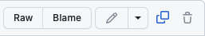

## Bienvenu sur les démos du cours ASD1

Ce repo vise à mettre à disposition des étudiants de la [HEIG-VD](https://heig-vd.ch) des démonstrations qui illustrent les sujets traités dans le cours ASD1. N'hésitez pas à compiler ces codes en les modifiant si besoin pour mieux explorer les sujets traités.

Vous pouvez utiliser ces codes comme suit :
   - Visualiser les codes dans votre navigateur avec l'URL

      `https://github.com/gmbreguet/PRG1_DEMO`

   - Copier/Coller le code dans votre environnement de développement

      

   - Cloner ce git avec la commande

      `git clone git@github.com:gmbreguet/PRG1_DEMO.git`

**NB** : Ce repo est mis à jour très régulièrement. 
Merci d'avance de vos retours. 
(C) Guy-Michel Breguet
